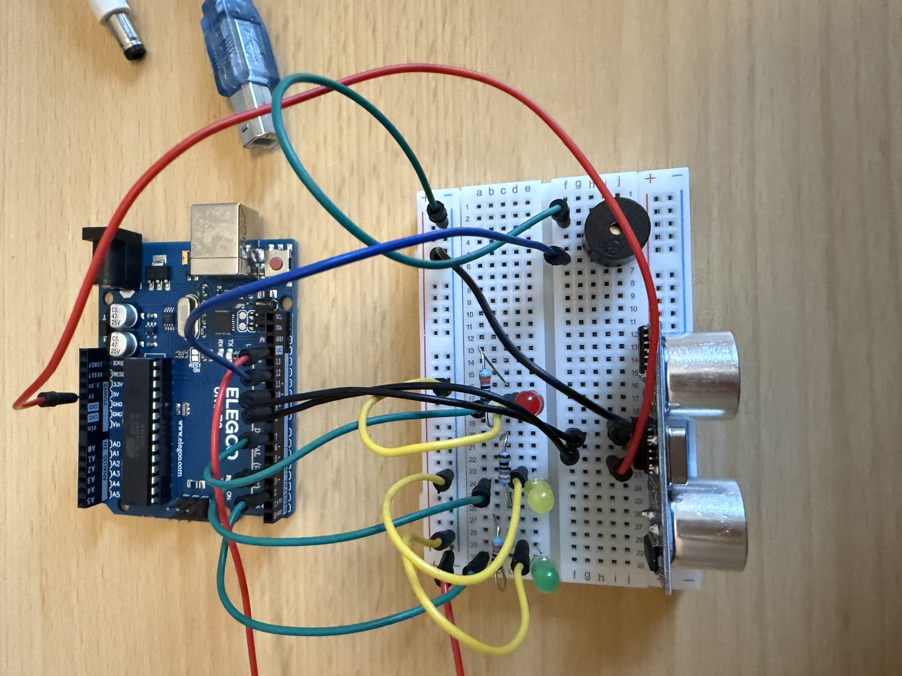

# Arduino Smart Parking Sensor

A simple smart parking sensor built with an Arduino UNO, HC-SR04 ultrasonic sensor, LEDs, and a buzzer.

The system measures the distance between the sensor and an object and provides visual and audio feedback depending on how close the object is.

## Project Demo

▶️ [Watch the demo video](demo.mp4)

## Features

- Measures distance using an HC-SR04 ultrasonic sensor
- Green LED indicates a safe distance
- Yellow LED indicates a medium distance
- Red LED indicates that the object is very close
- Buzzer beeps faster as the object gets closer
- Distance is displayed in the Arduino Serial Monitor

## Components

- Arduino UNO R3
- HC-SR04 Ultrasonic Sensor
- Green LED
- Yellow LED
- Red LED
- Passive Buzzer
- 3 × 220Ω or 330Ω resistors
- Breadboard
- Jumper wires

## Pin Connections

| Component | Arduino Pin |
|-----------|-------------|
| HC-SR04 TRIG | 9 |
| HC-SR04 ECHO | 10 |
| Green LED | 2 |
| Yellow LED | 4 |
| Red LED | 7 |
| Buzzer | 6 |

HC-SR04 power connections:

- VCC → 5V
- GND → GND

## How It Works

The HC-SR04 sends an ultrasonic pulse and measures how long it takes for the sound wave to return.

The Arduino calculates the distance using:

`distance = duration × 0.0343 / 2`

The result is then used to control the LEDs and buzzer.

| Distance | LED | Buzzer |
|----------|-----|--------|
| Less than 10 cm | Red | Fast beep |
| 10–30 cm | Yellow | Medium beep |
| More than 30 cm | Green | Off |

## What I Learned

Through this project I learned:

- How an ultrasonic distance sensor works
- How to use TRIG and ECHO pins
- How to measure pulse duration with `pulseIn()`
- How to calculate distance from time
- How to use `if`, `else if`, and `else`
- How to control multiple outputs using sensor data
- How to use a passive buzzer with `tone()` and `noTone()`

## Arduino Code

The complete Arduino code is available here:

[`smart_parking_sensor.ino`](smart_parking_sensor.ino)

## Future Improvements

- Replace `delay()` with `millis()` for non-blocking timing
- Add an LCD or OLED display
- Add more distance levels
- Create a more realistic parking assistant enclosure
